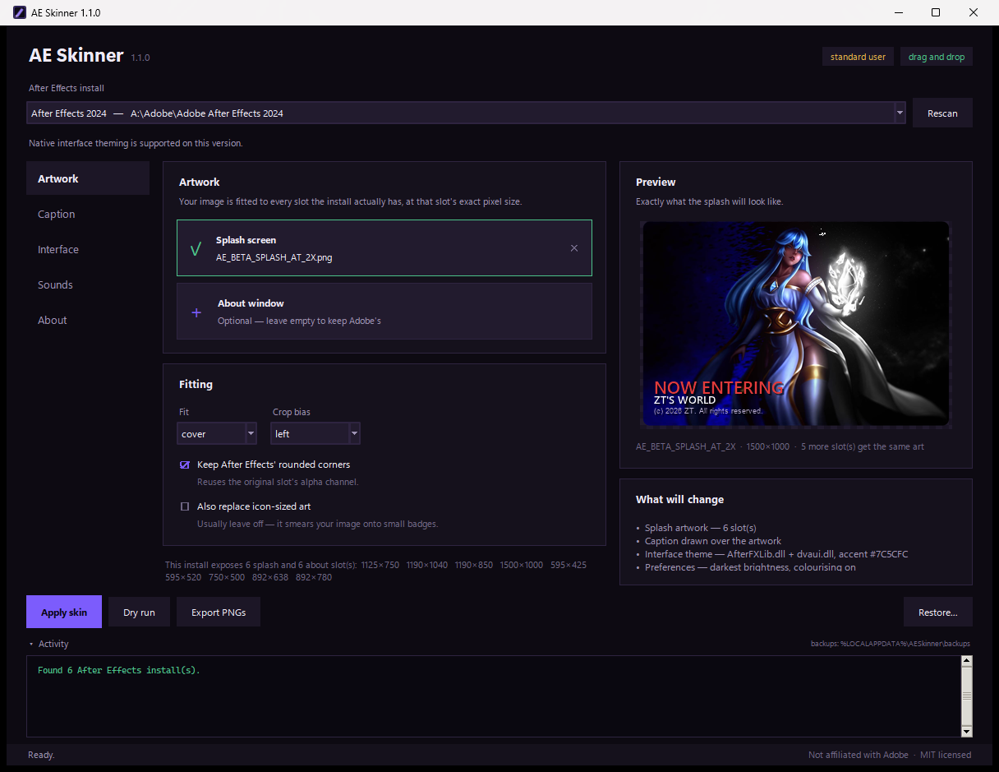
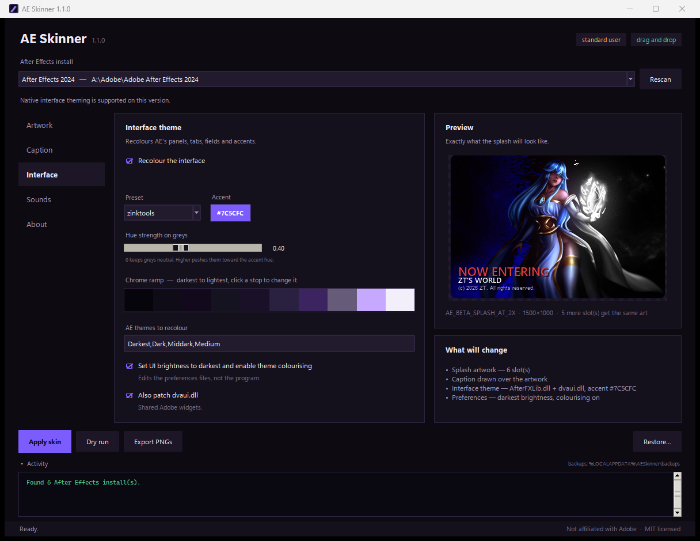

# AE Skinner

Reskin **any** After Effects install on **any** machine. Drop in an image, pick
colours, hit Apply. Everything it touches is backed up first and can be put back
with one click.

Nothing is hardcoded: AE Skinner finds your installs, reads the artwork sizes,
resource languages and colour-ramp lengths out of the binaries themselves, and
adapts to what it finds. It works the same on a stock install and on one that
has already been skinned. See [TECHNICAL.md](TECHNICAL.md) for what that took.



---

## Quick start

**If you have the packaged release:** unzip it, close After Effects, run
`AE Skinner.exe`. Nothing to install.

**From source:**

1. Python 3.9+ from [python.org](https://python.org) — tick **Add python.exe to PATH**.
2. Double-click `Install requirements.bat` (once).
3. Double-click `AE Skinner.bat`.

Either way it asks for administrator rights, which installs under
`C:\Program Files` need.

---

## What it can change

| | What | Works on |
|---|---|---|
| **Splash** | The startup screen, every resolution variant | every version |
| **About** | The About window card | every version |
| **Caption** | Title / subtitle / footer drawn over your art | every version |
| **Interface** | Panels, tabs, fields, accents, guides | **AE 2024 and older** |
| **Sounds** | The render-finished / render-failed chimes | every version |



### The AE 2025+ caveat

Adobe removed native interface theme colouring in the 2025 line. The colour
resources are still in the binary and AE Skinner will still patch and verify
them, but AE ignores their hue and the panels stay grey. The tool labels those
installs `no theme` in the picker and warns before applying.

Splash, About and sounds work on every version, 2025 and 2026 included.

---

## Safety

This tool rewrites resources inside installed program binaries, so it is built
to be careful about it.

**It refuses to patch anything that is not Adobe's.** Every target binary is
checked against its PE version information before a single byte is written. Aim
it at some other DLL and it stops:

```
BLOCK notepad.exe  does not identify itself as Adobe software
                   (CompanyName='Microsoft Corporation'); refusing to patch it
```

**Backups live outside the Adobe folder**, in
`%LOCALAPPDATA%\AESkinner\backups\`, because a Creative Cloud update replaces
the binaries and wipes anything sitting next to them. Every apply writes a
timestamped snapshot with a SHA-256 of each original.

**Restore re-verifies before it writes.** The snapshot manifest holds absolute
destinations. We wrote them, but it is plain JSON on disk, so on restore every
destination is re-checked against the known install roots and every stored file
is re-hashed. A tampered manifest cannot make the tool write somewhere else.

**Failures roll back.** Resources are written as one batch, the result is read
back and compared byte-for-byte, and if verification fails the snapshot is
restored before the error is reported.

**Images are opened defensively.** `MAX_IMAGE_PIXELS` is pinned well below
Pillow's default, `DecompressionBombWarning` is promoted to an error, and the
format list is explicitly allowlisted — EPS is excluded because Pillow shells
out to Ghostscript for it. Guidance from Pillow's
[security handbook](https://pillow.readthedocs.io/en/stable/handbook/security.html).

**Theme files are validated, not trusted.** Every field is bounds-checked and
pattern-matched before it reaches the patcher: hex colours, ramp length, theme
identifiers, and every float clamped to its range.

**Other guards:** it refuses to run while After Effects is open, checks free
disk space before backing up, writes text files atomically via `os.replace`,
and reports the Authenticode status of each binary (informational — patching
invalidates Adobe's signature by design, so "signed but modified" is the
expected state after skinning).

---

## Command line

```bash
aeskin list
```

Every command takes an *install selector*: a year (`2024`), a label fragment
(`beta`), an id from `list`, a full path, or `all`.

```bash
aeskin inspect 2024
```

Artwork slots and their exact pixel sizes, colour resources, sound files,
signature status, and how many backups exist.

```bash
aeskin apply 2024 --image "C:\art\mysplash.png" --focus left --theme zinktools
```

```bash
aeskin apply 2024 --dry-run --theme midnight
```

Plans everything and writes nothing. Always worth running first.

```bash
aeskin preview 2024 --image "C:\art\mysplash.png" -o "C:\out"
aeskin restore 2024
aeskin backups 2024 -v
aeskin themes
aeskin doctor
```

### Useful options

**Artwork** — `--image`, `--splash`, `--about`, `--fit cover|contain|stretch`,
`--focus left`, `--no-mask`, `--include-small`

**Caption** — `--title`, `--subtitle`, `--footer`, `--title-color`,
`--subtitle-color`, `--footer-color`, `--text-align`, `--text-anchor`,
`--font`, `--no-text-shadow`

```bash
aeskin apply 2024 --image art.png --focus left ^
  --title "NOW ENTERING" --title-color "#E23B3B" ^
  --subtitle "ZT'S WORLD" ^
  --footer "(c) 2026 ZT. All rights reserved."
```

**Theme** — `--theme NAME|FILE`, `--accent "#7C5CFC"`, `--ramp "#07050C,..."`,
`--themes "Darkest,Dark"`, `--tint-strength 0.4`, `--no-prefs`, `--no-dvaui`

Presets: `zinktools`, `midnight`, `carbon`, `ember`, `forest`, `crimson`.

**Sounds** — `--sound FILE`, `--sound-target rnd_okay.wav` (repeatable)

Without `--sound-target` every sound in the install is replaced. Any audio
format works if ffmpeg is on PATH; without it, supply a 16-bit PCM `.wav`.

---

## Writing your own theme

```bash
aeskin themes --export mytheme.json
aeskin apply 2024 --theme mytheme.json
```

```json
{
  "name": "My Theme",
  "accent": "#7C5CFC",
  "ramp": ["#07050C", "#0F0C18", "...", "#F2EEFA"],
  "tint_hue": null,
  "tint_max_sat": 0.40,
  "tint_value_ceiling": 0.55,
  "themes": ["Darkest", "Dark", "Middark", "Medium"]
}
```

- **`ramp`** is the chrome, darkest first. Length does not matter — it is
  resampled to whatever the install needs.
- **`tint_hue`** defaults to the accent's hue. It is what greys get pushed
  towards; `tint_max_sat: 0` keeps them neutral.
- **`tint_value_ceiling`** is the brightness above which greys are left alone,
  so text and light themes stay readable.

Drop a `.json` into the `themes/` folder next to the app and it appears in the
preset list. Files there override the ones baked into the build.

---

## Troubleshooting

| | |
|---|---|
| "After Effects is running" | Close it — check Task Manager for a leftover `AfterFX.exe`. |
| "cannot write … administrator" | Relaunch via `AE Skinner.bat` / the `.exe`, which elevates. |
| Applied it but panels are grey | Check the picker. `no theme` means the AE 2025+ limitation above. |
| "Windows protected your PC" | The exe is not code-signed. More info → Run anyway. |
| ffmpeg missing for sounds | Install ffmpeg, or supply a 16-bit PCM `.wav`. |
| Drag and drop does nothing | `pip install tkinterdnd2`. Click-to-browse works either way. |
| Skin vanished after an update | Creative Cloud replaced the binaries. Run AE Skinner again. |

---

## Layout

```
AE Skinner.bat            elevating launcher for the GUI
Install requirements.bat  one-time dependency install
AESkinner.pyw             the GUI  (--selftest verifies a build headlessly)
aeskin.bat / aeskin_cli.py  command line
themes/*.json             presets
aeskin/
  installs.py   finds AE installs, versions, prefs folders
  pe.py         reads and rewrites PE resources
  images.py     splash/about discovery, rendering, and the preview caches
  theming.py    the colour transforms
  security.py   target verification, input validation, restore guards
  sounds.py     wav conversion and replacement
  backup.py     the snapshot store
  apply.py      plan, preflight, execute, verify, roll back
  cli.py        argument parsing
```

---

## Licence and disclaimer

MIT — see [LICENSE](LICENSE). Bundled dependencies are listed in
[THIRD-PARTY-NOTICES.md](THIRD-PARTY-NOTICES.md).

**Not affiliated with, endorsed by, or connected to Adobe Inc.** AE Skinner
contains no Adobe code or assets; it rewrites resources in the copy of After
Effects already installed on your machine, and circumvents no licensing,
activation or protection measure. Modifying an installed application may
conflict with its licence agreement — that is your call. Please read
[NOTICE.md](NOTICE.md) before redistributing anything.

**Do not distribute patched Adobe binaries.** Share this tool, not the output.

---

## References

Behaviour and design decisions that came from documentation rather than from
poking at binaries:

- Pillow, [Security handbook](https://pillow.readthedocs.io/en/stable/handbook/security.html) — decompression bombs, `MAX_IMAGE_PIXELS`, format allowlisting, why EPS is excluded
- Pillow, [`Image` module reference](https://pillow.readthedocs.io/en/stable/reference/Image.html) — `DecompressionBombWarning` / `DecompressionBombError` thresholds
- Microsoft, [Typography in Windows](https://learn.microsoft.com/en-us/windows/apps/design/signature-experiences/typography) — Segoe UI Variable, and Semibold rather than Bold for emphasis
- Microsoft, [Design guidelines for Windows apps](https://learn.microsoft.com/en-us/windows/apps/design/guidelines-overview) — layout and spacing
- Microsoft, [`WinVerifyTrust`](https://learn.microsoft.com/en-us/windows/win32/api/wintrust/nf-wintrust-winverifytrust) — Authenticode status reporting
- [Tkinter entry on-change handling](https://copyprogramming.com/howto/tkinter-entry-on-change) — the `after_cancel` + `after` debounce pattern for callbacks over ~50 ms
- PyInstaller, [License](https://pyinstaller.org/en/stable/license.html) — the GPL bootloader exception that lets the packaged build ship under MIT
